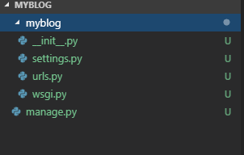

[템플릿 자료](https://colorlib.com/thank-you-for-downloading/?dlm-dp-dl=2210)

# 1. 기본 환경 세팅
### 1) 가상환경 켜주기

### 2) `pip install django`


### 3) `django-admin startproject myblog`





[기본 폴더 모습] 


### 4) `python manage.py startapp blog`


### 5) `installed_apps`에 `blog` 알려주기

myblog/settings.py


### 6) 첫 시작화면(`blog/templates/home.html`) 만들어주기 


### 7) url 부착

`path(url이름 , app이름.view파일.함수이름 , name="별명"),`


<details>
<summary><strong>blog/urls.py</strong></summary>
    
```python
import blog.views
urlpatterns = [
    path('admin/', admin.site.urls),
    path('', blog.views.home, name="home"),
]

```
</details>


### 8) views 파일에 home 함수 만들어주기


<details>
<summary><strong>blog/views.py</strong></summary>

```python
def home(request):
    return render(request, 'home.html')
```
</details>

### 9) 서버실행
`python manage.py runserver`

아무것도 안보이면 정상


# 2. Template 연동하는법

### 1) `static` 루트를 장고에게 알려준다.

- 장고는 기본적으로 웹페이지에 사용할 정적 파일들을 한곳에 모아서 보관하는데, 이 위치를 알려준다고 생각하면 된다.


<details>
<summary><strong>myblog/settings.py</strong></summary>
```python
#  스태틱 파일들이 존재하는 폴더 위치를 알려준다.
STATICFILES_DIRS = (os.path.join('static'),)
```
</details>


### 2) 폴더 생성 및 파일 업로드

- `myblog/blog`
- `myblog/myblog`
- `myblog/static`

- `static` 폴더 생성(blog와 같은 레벨의 디렉토리에)

- 생성한 `static`폴더를 우측 클릭 `Reveal in Explorer`을 눌러 폴더를 켜주고, static 폴더안에 템플릿 스태틱 파일들을 넣어준다.


### 3) `home.html`

#### 1. blog/templates/home.html 파일에 템플릿의 `index.html` 코드 복붙


<details>
<summary><strong>c.f 우선 시험삼아 그냥 코드를 돌려보자</strong></summary>
<code style="white-space:nowrap;">python manage.py makemigrations</code><br/>
<code style="white-space:nowrap;">python manage.py migrate</code><br/>
<code style="white-space:nowrap;">python manage.py runserver</code><br/>
<br/><br/>


</details>


- 이상하게 나오는 이유는  `home.html`에서 `settings.py`가 찾아준 staticfile들을 페이지에 load해주어야 하는데 아직 해주지 않아서이다.


#### 2. static 붙여주기

<details>
<summary><strong>blog/templates/home.html</strong></summary>

```python

<!doctype html>
<html lang="en">
  <head>
    <title>민욱이형 굳 &mdash; 민욱이의 blog</title>
    <meta charset="utf-8">
    <meta name="viewport" content="width=device-width, initial-scale=1, shrink-to-fit=no">

    <link href="https://fonts.googleapis.com/css?family=Josefin+Sans:300, 400,700|Inconsolata:400,700" rel="stylesheet">
"{% static '
    <link rel="stylesheet" href="">
    <link rel="stylesheet" href="">
    <link rel="stylesheet" href="">

    <link rel="stylesheet" href="fonts/ionicons/css/ionicons.min.css">
    <link rel="stylesheet" href="fonts/fontawesome/css/font-awesome.min.css">
    <link rel="stylesheet" href="fonts/flaticon/font/flaticon.css">

    <!-- Theme Style -->
    <link rel="stylesheet" href="">
  </head>

```
</details>

#### 3. script에도 붙여주자

wrap을 숨김 처리하면 밑에 `script` 파트 또한 static을 붙여준다.

<details>
<summary><strong>blog/templates/home.html</strong></summary>

```python

<div class="wrap">
...
</div>


<!-- loader -->
<div id="loader" class="show fullscreen"><svg class="circular" width="48px" height="48px"><circleclass="path-bg" cx="24" cy="24" r="22" fill="none" stroke-width="4" stroke="#eeeeee"/><circleclass="path" cx="24" cy="24" r="22" fill="none" stroke-width="4" stroke-miterlimit="10"stroke="#f4b214"/></svg></div>

<script src=""></script>
<script src=""></script>
<script src=""></script>
<script src=""></script>
<script src=""></script>
<script src=""></script>
<script src=""></script>

    
<script src=""></script>

```

</details>


`UnicodeDecodeError: 'cp949' codec can't decode byte 0xe2 in position 9735: illegal multibyte sequence` 에러가 뜸...


찾아보니까 js 앞에 `'`를 안붙였었음


<details>
<summary><strong>blog/templates/home.html 수정</strong></summary>
 
```python
    <script src=""></script>
    <script src=""></script>
    <script src=""></script>
    <script src=""></script>
    <script src=""></script>
    <script src=""></script>
    <script src=""></script>
    <script src=""></script>
```
</details>


#### 4. home.html 요약

복잡한 템플릿을 분석해보자면 크게 4가지 요소로 나눠진다.


```html
<body>
<div class="wrap">
    <!-- 1.배너 부분 -->
    <header role="banner"></header>
    <!-- 2.카로셀 들어있는 부분 -->
    <section class="site-section pt-5 pb-5"></section>
    <!-- 3.본문 -->
    <section class="site-section py-sm"></section>
    <!-- 4.footer -->
    <footer class="site-footer"></footer>
</div>
</body>
```


#### 5. 먼저 `2. carousel` 바꿔주자


<details>
<summary><strong>blog/templates/home.html</strong></summary>
    
```html
      <section class="site-section pt-5 pb-5">
        <div class="container">
          <div class="row">
            <div class="col-md-12">

              <div class="owl-carousel owl-theme home-slider">
                <div>
                <!-- 글의 사진  -->
                  <a href="#" class="a-block d-flex align-items-center height-lg" style="background-image: url()">
                    <div class="text half-to-full">
                      <span class="category mb-5">post 카테고리</span>
                      <div class="post-meta">
                        
                        <span class="author mr-2"> 작성자 이름</span>&bullet;
                        <span class="mr-2">작성 date </span> &bullet;
                        <span class="ml-2"><span class="fa fa-comments"></span> reply 갯수</span>
                        
                      </div>
                      <h3>post 제목</h3>
                      <p>post 본문</p>
                    </div>
                  </a>
                </div>
              </div>
            </div>
          </div>   
        </div>
      </section>
```

</details>

#### 6. `3.본문` 을 수정해주자


- 1. `sidebar` 삭제 

- 2.  `<div class="col-md-12 col-lg-8 main-content">`  -> `<div class="main-content">`

- 3. 글이 8개 있는데 우리는 1개만 남겨줍니다.

- 4. `pagination logic`이 안되어있으니까 주석처리 or 삭제

- 5. `footer` 필요없는거 모두 삭제 후 가운데 정렬 처리


<details>
<summary><strong>blog/templates/home.html</strong></summary>
    
```python
      <section class="site-section py-sm">
        <div class="container">
          <div class="row">
            <div class="col-md-6">
              <h2 class="mb-4">Latest Posts</h2>
            </div>
          </div>
          <div class="row blog-entries">
            <div class="main-content">
              <div class="row">
                <div class="col-md-6">
                    <!-- post url -->
                  <a href="#" class="blog-entry element-animate" data-animate-effect="fadeIn">
                      <!-- post img -->
                    
                    <div class="blog-content-body">
                      <div class="post-meta">
                        <span class="author mr-2"> 작성자 이름</span>&bullet;
                        <span class="mr-2">작성 date </span> &bullet;
                        <span class="ml-2"><span class="fa fa-comments"></span> reply 갯수</span>
                      </div>
                      <h2>post title</h2>
                    </div>
                  </a>
                </div>
                
<!-- 페이지네이션 -->
              <!-- <div class="row mt-5">
                <div class="col-md-12 text-center">
                  <nav aria-label="Page navigation" class="text-center">
                    <ul class="pagination">
                      <li class="page-item  active"><a class="page-link" href="#">&lt;</a></li>
                      <li class="page-item"><a class="page-link" href="#">1</a></li>
                      <li class="page-item"><a class="page-link" href="#">2</a></li>
                      <li class="page-item"><a class="page-link" href="#">3</a></li>
                      <li class="page-item"><a class="page-link" href="#">4</a></li>
                      <li class="page-item"><a class="page-link" href="#">5</a></li>
                      <li class="page-item"><a class="page-link" href="#">&gt;</a></li>
                    </ul>
                  </nav>
                </div>
              </div> -->


              
            </div>

            <!-- END main-content -->

          </div>
        </div>
      </section>
```
</details>


지금까지의 파일 혹시 놓쳤으면 복붙하세여

<details>
<summary><strong>blog/templates/home.html 전체 코드</strong></summary>

```python

<!doctype html>
<html lang="en">
  <head>
    <title>minwook &mdash; minwook blog</title>
    <meta charset="utf-8">
    <meta name="viewport" content="width=device-width, initial-scale=1, shrink-to-fit=no">

    <link href="https://fonts.googleapis.com/css?family=Josefin+Sans:300, 400,700|Inconsolata:400,700" rel="stylesheet">

    <link rel="stylesheet" href="">
    <link rel="stylesheet" href="">
    <link rel="stylesheet" href="">

    <link rel="stylesheet" href="fonts/ionicons/css/ionicons.min.css">
    <link rel="stylesheet" href="fonts/fontawesome/css/font-awesome.min.css">
    <link rel="stylesheet" href="fonts/flaticon/font/flaticon.css">

    <!-- Theme Style -->
    <link rel="stylesheet" href="">
  </head>
  <body>
    

    <div class="wrap">

      <header role="banner">
        <div class="top-bar">
          <div class="container">
            <div class="row">
              <div class="col-9 social">
                <a href="#"><span class="fa fa-twitter"></span></a>
                <a href="#"><span class="fa fa-facebook"></span></a>
                <a href="#"><span class="fa fa-instagram"></span></a>
                <a href="#"><span class="fa fa-youtube-play"></span></a>
              </div>
              <div class="col-3 search-top">
                <!-- <a href="#"><span class="fa fa-search"></span></a> -->
                <form action="#" class="search-top-form">
                  <span class="icon fa fa-search"></span>
                  <input type="text" id="s" placeholder="Type keyword to search...">
                </form>
              </div>
            </div>
          </div>
        </div>

        <div class="container logo-wrap">
          <div class="row pt-5">
            <div class="col-12 text-center">
              <a class="absolute-toggle d-block d-md-none" data-toggle="collapse" href="#navbarMenu" role="button" aria-expanded="false" aria-controls="navbarMenu"><span class="burger-lines"></span></a>
              <h1 class="site-logo"><a href="index.html">Minwook</a></h1>
            </div>
          </div>
        </div>
        
        <nav class="navbar navbar-expand-md  navbar-light bg-light">
          <div class="container">
            
           
            <div class="collapse navbar-collapse" id="navbarMenu">
              <ul class="navbar-nav mx-auto">
                <li class="nav-item">
                  <a class="nav-link active" href="index.html">Home</a>
                </li>
                <li class="nav-item">
                  <a class="nav-link" href="#">Business</a>
                </li>
                <li class="nav-item dropdown">
                  <a class="nav-link dropdown-toggle" href="category.html" id="dropdown04" data-toggle="dropdown" aria-haspopup="true" aria-expanded="false">Travel</a>
                  <div class="dropdown-menu" aria-labelledby="dropdown04">
                    <a class="dropdown-item" href="category.html">Asia</a>
                    <a class="dropdown-item" href="category.html">Europe</a>
                    <a class="dropdown-item" href="category.html">Dubai</a>
                    <a class="dropdown-item" href="category.html">Africa</a>
                    <a class="dropdown-item" href="category.html">South America</a>
                  </div>

                </li>

                <li class="nav-item dropdown">
                  <a class="nav-link dropdown-toggle" href="category.html" id="dropdown05" data-toggle="dropdown" aria-haspopup="true" aria-expanded="false">Categories</a>
                  <div class="dropdown-menu" aria-labelledby="dropdown05">
                    <a class="dropdown-item" href="category.html">Lifestyle</a>
                    <a class="dropdown-item" href="category.html">Food</a>
                    <a class="dropdown-item" href="category.html">Adventure</a>
                    <a class="dropdown-item" href="category.html">Travel</a>
                    <a class="dropdown-item" href="category.html">Business</a>
                  </div>

                </li>
                <li class="nav-item">
                  <a class="nav-link" href="about.html">About</a>
                </li>
                <li class="nav-item">
                  <a class="nav-link" href="contact.html">Contact</a>
                </li>
              </ul>
              
            </div>
          </div>
        </nav>
      </header>
      <!-- END header -->

  
      <section class="site-section pt-5 pb-5">
        <div class="container">
          <div class="row">
            <div class="col-md-12">

              <div class="owl-carousel owl-theme home-slider">
                <div>
                <!-- 글의 사진  -->
                  <a href="#" class="a-block d-flex align-items-center height-lg" style="background-image: url()">
                    <div class="text half-to-full">
                      <span class="category mb-5">post 카테고리</span>
                      <div class="post-meta">
                        
                        <span class="author mr-2"> 작성자 이름</span>&bullet;
                        <span class="mr-2">작성 date </span> &bullet;
                        <span class="ml-2"><span class="fa fa-comments"></span> reply 갯수</span>
                        
                      </div>
                      <h3>post 제목</h3>
                      <p>post 본문</p>
                    </div>
                  </a>
                </div>
              </div>
            </div>
          </div>   
        </div>
      </section>
      <!-- END section -->

      <section class="site-section py-sm">
        <div class="container">
          <div class="row">
            <div class="col-md-6">
              <h2 class="mb-4">Latest Posts</h2>
            </div>
          </div>
          <div class="row blog-entries">
            <div class="main-content">
              <div class="row">
                <div class="col-md-6">
                    <!-- post url -->
                  <a href="#" class="blog-entry element-animate" data-animate-effect="fadeIn">
                      <!-- post img -->
                    
                    <div class="blog-content-body">
                      <div class="post-meta">
                        <span class="author mr-2"> 작성자 이름</span>&bullet;
                        <span class="mr-2">작성 date </span> &bullet;
                        <span class="ml-2"><span class="fa fa-comments"></span> reply 갯수</span>
                      </div>
                      <h2>post title</h2>
                    </div>
                  </a>
                </div>
                
<!-- 페이지네이션 -->
              <!-- <div class="row mt-5">
                <div class="col-md-12 text-center">
                  <nav aria-label="Page navigation" class="text-center">
                    <ul class="pagination">
                      <li class="page-item  active"><a class="page-link" href="#">&lt;</a></li>
                      <li class="page-item"><a class="page-link" href="#">1</a></li>
                      <li class="page-item"><a class="page-link" href="#">2</a></li>
                      <li class="page-item"><a class="page-link" href="#">3</a></li>
                      <li class="page-item"><a class="page-link" href="#">4</a></li>
                      <li class="page-item"><a class="page-link" href="#">5</a></li>
                      <li class="page-item"><a class="page-link" href="#">&gt;</a></li>
                    </ul>
                  </nav>
                </div>
              </div> -->


              
            </div>

            <!-- END main-content -->

          </div>
        </div>
      </section>
    
      <footer class="site-footer">
        <div class="container">

          <div class="row">

                <div class="col-md-12 text-center ">
                    <p>내가 누군지 간단 설명...<a href="#">어바웃 페이지 링크</a></p>
                </div>

            <!-- </div> -->
          </div>


          <div class="row">
            <div class="col-md-12 text-center">
              <p class="small">
            <!-- Link back to Colorlib can't be removed. Template is licensed under CC BY 3.0. -->
            Copyright &copy; <script data-cfasync="false" src="/cdn-cgi/scripts/5c5dd728/cloudflare-static/email-decode.min.js"></script><script>document.write(new Date().getFullYear());</script> All Rights Reserved | This template is made with <i class="fa fa-heart text-danger" aria-hidden="true"></i> by <a href="github.com/minkj1992" target="_blank" >Minkj1992</a>
            <!-- Link back to Colorlib can't be removed. Template is licensed under CC BY 3.0. -->
            </p>
            </div>
          </div>
        </div>
      </footer>
      <!-- END footer -->

    </div>
    
    <!-- loader -->
    <div id="loader" class="show fullscreen"><svg class="circular" width="48px" height="48px"><circle class="path-bg" cx="24" cy="24" r="22" fill="none" stroke-width="4" stroke="#eeeeee"/><circle class="path" cx="24" cy="24" r="22" fill="none" stroke-width="4" stroke-miterlimit="10" stroke="#f4b214"/></svg></div>

    <script src=""></script>
    <script src=""></script>
    <script src=""></script>
    <script src=""></script>
    <script src=""></script>
    <script src=""></script>
    <script src=""></script>
    <script src=""></script>
  </body>
</html>
```
</details>


# 3. DB 연동하는법


> 이제는 데이터베이스 모양을 class를 통하여 지정해주고, manage.py에게 시켜서 자동으로 db화 해주는 작업을 해봅시다.


지금까지 템플릿을 보면 필요한 `db`는 `User`[name, image], `Post(글)`[title,context,category,reply(fk)]가 필요.


### 1) 클래스 정의

<details>
<summary><strong>blog/models.py</strong></summary>

```python
from django.db import models
from django.utils import timezone
from django.contrib.auth.models import User

# Create your models here.

class Post(models.Model):
    title = models.CharField(max_length=50,default="제목")
    created_at = models.DateTimeField(default=timezone.now)

    # 글 종류
    category = models.CharField(max_length=255)
    # 본문
    context = models.TextField(max_length=4000)
    # 작성자
    created_by = models.ForeignKey(User, related_name='posts',on_delete=models.CASCADE)
    # 글 이미지
    file = models.FileField(null=True)
```
</details>


### 2) Media 설정 
- 글을 게시할때 upload하기 위해서는 media 디렉토리가 필요하다.


<details>
<summary><strong>myblog/settings.py</strong></summary>

```python

STATIC_URL = '/static/'

#  스태틱 파일들이 존재하는 폴더 위치를 알려준다.
STATICFILES_DIRS = (os.path.join('static'),)

MEDIA_URL = '/media/'
MEDIA_ROOT = os.path.join(BASE_DIR, 'media')
```
</details>


### 3) 이후 static 폴더 처럼 media 폴더 생성


### 4)  url 설정에 upload시 `MEDIA_ROOT`에 파일이 저장되도록 설정한다.

<details>
<summary><strong>blog/urls.py</strong></summary>

```python
from django.contrib import admin
from django.urls import path
import blog.views
# 파일 업로드 하기 위해서
from django.conf import settings
from django.conf.urls.static import static

urlpatterns = [
    path('admin/', admin.site.urls),
    path('', blog.views.home, name="home"),
] + static(settings.MEDIA_URL, document_root=settings.MEDIA_ROOT) # 파일 업로드 하기 위해서

```
</details>

### 5) admin page에서 Post를 생성 가능하도록한다.  

<details>
<summary><strong>blog/admin.py</strong></summary>

```python
from django.contrib import admin

# Register your models here.
from .models import Post


admin.site.register(Post)
```
</details>

### 6) 일단 실행해보자


- `python manage.py makemigrations `
- `python manage.py migrate `

장고 사이트에서 슈퍼 유저 생성하는 코드 
- `python manage.py createsuperuser`


### 7) admin 들어가서 post 생성


### 7) post의 목록을 title로 보여주고 싶다면 


blog/models.py

```python
    def __str__(self):
        return self.title
```


이제 대략 6개 정도 생성해보자(view에서 예쁘게 보이도록 하기위해서)


### 8) `views.py`-> `home.html`로  Post들 전달하기


<details>
<summary><strong>blog/views.py</strong></summary>

```python
from django.shortcuts import render

from .models import Post

def home(request):
    posts = Post.objects.all().order_by('-created_at')
    return render(request, 'home.html',{'posts':posts})
```

</details>


### 9) `home.html`에서 Post들 받기


<details>
<summary><strong>blog/templates/home.html</strong></summary>

```python
                
                <div class="col-md-6">
                    <!-- post url -->
                  <a href="#" class="blog-entry element-animate" data-animate-effect="fadeIn">
                      <!-- post img -->
                    
                    <div class="blog-content-body">
                      <div class="post-meta">
                        <span class="author mr-2">{{ post.created_by }}</span>&bullet;
                        <span class="mr-2">{{ post.created_at }}</span> &bullet;
                        <span class="ml-2"><span class="fa fa-comments"></span> reply 갯수</span>
                      </div>
                      <h2>{{ post.title }}</h2>
                    </div>
                  </a>
                </div>
                
```

</details>


`img src="{{ post.file.url }}"` 이부분이 중요, media로 저장한 파일은 .url로 가져올 수 있다.


아래는 수정된  페이지 모습


** 이상 지금까지 장고에서 free html `template`을 부착시키는 방법과, `models`를 사용하여 db와 연동하는 방법을 설명하였습니다. **


### 9) 추후 진행해보면 좋은 것

- 카로셀에 random하게 3개 post들 보여주기
- db에 create/read/upload/destroy 하는 즉 crud 페이지 구현해보기 (매우 유용)
- 로그인 페이지 만들기
- 카테고리별로 분류하기 등등 

